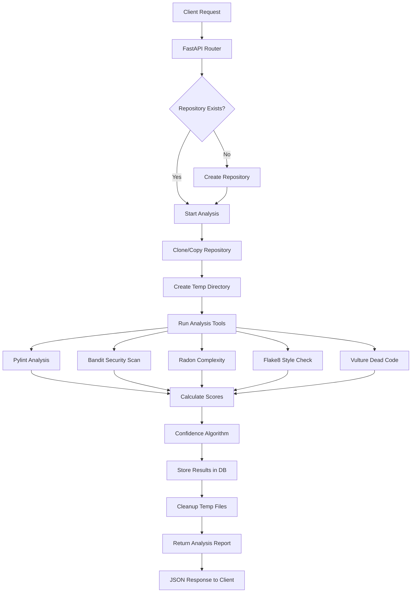
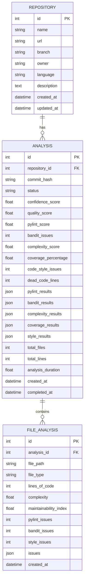

# Code Review Analyzer 🔍

<div align="center">
  
  
  
  
</div>

A comprehensive **Python-based code analysis platform** that provides quality assessment, security scanning, and confidence scoring for code repositories. Built with **FastAPI** and integrated with multiple analysis tools.

## 🚀 Features

- **🔧 Multi-Tool Analysis**: Integrates pylint, bandit, radon, flake8, and vulture
- **📊 Confidence Scoring**: Weighted scoring algorithm for overall code quality (0-100)
- **🔒 Security Scanning**: Identifies potential security vulnerabilities with Bandit
- **📈 Complexity Analysis**: Measures cyclomatic complexity and maintainability
- **🌐 REST API**: FastAPI-based API with automatic documentation
- **💾 Database Storage**: Persistent storage of analysis results with SQLAlchemy
- **⚡ Background Processing**: Celery integration for long-running analyses
- **🐙 Git Integration**: Supports GitHub URLs and local repositories
- **📝 Detailed Reports**: JSON responses with comprehensive metrics

## Quick Start

### Prerequisites

- Python 3.8+
- Redis (for background tasks)
- Git

### Installation

1. **Clone and setup the project:**
```bash
cd code-review-analyzer
python -m venv venv
source venv/bin/activate  # On Windows: venv\Scripts\activate
pip install -r requirements.txt
```

2. **Set up environment variables:**
```bash
cp .env.example .env
# Edit .env with your configuration
```

3. **Start Redis (using Docker):**
```bash
docker-compose up -d redis
```

4. **Run the development server:**
```bash
./run_dev.py
# or
python run_dev.py
```

The API will be available at `http://localhost:8000`

## 📋 System Architecture

### Analysis Flow Diagram



### Database Schema



## 🌐 API Documentation

Once the server is running, visit:
- **Interactive API docs**: http://localhost:8000/docs
- **ReDoc documentation**: http://localhost:8000/redoc
- **Health Check**: http://localhost:8000/health

## 📚 API Endpoints Reference

### 📊 Health & Status

#### `GET /` - Root Endpoint
**Response:**
```json
{
  "message": "Code Review Analyzer API",
  "version": "1.0.0",
  "docs": "/docs",
  "status": "active"
}
```

#### `GET /health` - Health Check
**Response:**
```json
{
  "status": "healthy",
  "service": "code-review-analyzer"
}
```

### 💾 Repository Management

#### `POST /api/v1/repositories/` - Create Repository
**Request Body:**
```json
{
  "name": "my-python-project",
  "url": "https://github.com/username/repo.git",
  "branch": "main",
  "description": "A sample Python project for analysis"
}
```

**Success Response (201):**
```json
{
  "id": 1,
  "name": "my-python-project",
  "url": "https://github.com/username/repo.git",
  "branch": "main",
  "description": "A sample Python project for analysis",
  "language": "python",
  "owner": "username",
  "created_at": "2024-01-15T10:30:00Z",
  "updated_at": null
}
```

**Error Response (422):**
```json
{
  "detail": [
    {
      "loc": ["body", "url"],
      "msg": "invalid or missing URL",
      "type": "value_error.url"
    }
  ]
}
```

#### `GET /api/v1/repositories/` - List Repositories
**Query Parameters:**
- `skip` (int, default: 0) - Number of records to skip
- `limit` (int, default: 10) - Maximum number of records to return

**Example Request:**
```bash
GET /api/v1/repositories/?skip=0&limit=5
```

**Success Response (200):**
```json
[
  {
    "id": 1,
    "name": "my-python-project",
    "url": "https://github.com/username/repo.git",
    "branch": "main",
    "description": "A sample Python project",
    "language": "python",
    "owner": "username",
    "created_at": "2024-01-15T10:30:00Z",
    "updated_at": null
  },
  {
    "id": 2,
    "name": "another-project",
    "url": "https://github.com/user2/project.git",
    "branch": "develop",
    "description": "Another project",
    "language": "python",
    "owner": "user2",
    "created_at": "2024-01-15T11:00:00Z",
    "updated_at": null
  }
]
```

#### `DELETE /api/v1/repositories/{repo_id}` - Delete Repository
**Path Parameters:**
- `repo_id` (int) - Repository ID to delete

**Success Response (200):**
```json
{
  "id": 1,
  "name": "my-python-project",
  "url": "https://github.com/username/repo.git",
  "branch": "main",
  "description": "A sample Python project",
  "language": "python",
  "owner": "username",
  "created_at": "2024-01-15T10:30:00Z",
  "updated_at": null
}
```

**Error Response (404):**
```json
{
  "detail": "Repository not found"
}
```

### 🔍 Code Analysis

#### `POST /api/v1/analysis/analyze` - Start Analysis
**Request Body:**
```json
{
  "repository_id": 1,
  "commit_hash": "abc123def456" // optional
}
```

**Success Response (200) - Analysis in Progress:**
```json
{
  "id": 1,
  "repository_id": 1,
  "commit_hash": "abc123def456",
  "status": "running",
  "confidence_score": null,
  "quality_score": null,
  "pylint_score": null,
  "bandit_issues": 0,
  "complexity_score": null,
  "coverage_percentage": null,
  "code_style_issues": 0,
  "dead_code_lines": 0,
  "total_files": 0,
  "total_lines": 0,
  "analysis_duration": null,
  "created_at": "2024-01-15T12:00:00Z",
  "completed_at": null,
  "pylint_results": null,
  "bandit_results": null,
  "complexity_results": null,
  "coverage_results": null,
  "style_results": null,
  "file_analyses": []
}
```

**Success Response (200) - Analysis Completed:**
```json
{
  "id": 1,
  "repository_id": 1,
  "commit_hash": "abc123def456",
  "status": "completed",
  "confidence_score": 85.2,
  "quality_score": 87.1,
  "pylint_score": 8.5,
  "bandit_issues": 2,
  "complexity_score": 3.2,
  "coverage_percentage": 78.5,
  "code_style_issues": 5,
  "dead_code_lines": 12,
  "total_files": 23,
  "total_lines": 1547,
  "analysis_duration": 12.3,
  "created_at": "2024-01-15T12:00:00Z",
  "completed_at": "2024-01-15T12:00:12Z",
  "pylint_results": [
    {
      "type": "warning",
      "module": "app.main",
      "obj": "main",
      "line": 15,
      "column": 0,
      "path": "app/main.py",
      "symbol": "unused-import",
      "message": "Unused import sys",
      "message-id": "W0611"
    }
  ],
  "bandit_results": [
    {
      "code": "import subprocess\nresult = subprocess.call(cmd, shell=True)",
      "col_offset": 9,
      "end_col_offset": 45,
      "filename": "app/analysis/analyzer.py",
      "issue_confidence": "HIGH",
      "issue_cwe": {
        "id": 78,
        "link": "https://cwe.mitre.org/data/definitions/78.html"
      },
      "issue_severity": "HIGH",
      "issue_text": "subprocess call with shell=True identified",
      "line_number": 45,
      "line_range": [45],
      "more_info": "https://bandit.readthedocs.io/en/latest/plugins/b602_subprocess_popen_with_shell_equals_true.html",
      "test_id": "B602",
      "test_name": "subprocess_popen_with_shell_equals_true"
    }
  ],
  "complexity_results": {
    "app/main.py": [
      {
        "type": "function",
        "rank": "A",
        "complexity": 2,
        "name": "main",
        "lineno": 10
      }
    ]
  },
  "coverage_results": null,
  "style_results": [
    {
      "file": "app/main.py",
      "line": 1,
      "column": 80,
      "code": "E501",
      "message": "line too long (85 > 79 characters)"
    }
  ],
  "file_analyses": [
    {
      "id": 1,
      "file_path": "app/main.py",
      "file_type": "python",
      "lines_of_code": 145,
      "complexity": 2.1,
      "maintainability_index": 78.5,
      "pylint_issues": 1,
      "bandit_issues": 0,
      "style_issues": 2,
      "issues": [
        {
          "type": "pylint",
          "severity": "warning",
          "message": "Unused import sys",
          "line": 15,
          "column": 0,
          "rule": "W0611"
        },
        {
          "type": "style",
          "severity": "error",
          "message": "line too long (85 > 79 characters)",
          "line": 1,
          "column": 80,
          "rule": "E501"
        }
      ]
    }
  ]
}
```

**Error Response (404):**
```json
{
  "detail": "Repository not found"
}
```

**Error Response (500) - Analysis Failed:**
```json
{
  "id": 1,
  "repository_id": 1,
  "status": "failed",
  "error": "Failed to clone repository: Authentication failed"
}
```

#### `GET /api/v1/analysis/{repo_id}` - Get Repository Details
**Path Parameters:**
- `repo_id` (int) - Repository ID

**Success Response (200):**
```json
{
  "id": 1,
  "name": "my-python-project",
  "url": "https://github.com/username/repo.git",
  "branch": "main",
  "description": "A sample Python project",
  "language": "python",
  "owner": "username",
  "created_at": "2024-01-15T10:30:00Z",
  "updated_at": null
}
```

## 📝 Usage Examples

### Complete Workflow Example

```bash
# 1. Create a repository
curl -X POST "http://localhost:8000/api/v1/repositories/" \
  -H "Content-Type: application/json" \
  -d '{
    "name": "flask-api-project",
    "url": "https://github.com/pallets/flask.git",
    "branch": "main",
    "description": "Flask web framework analysis"
  }'

# 2. Start analysis
curl -X POST "http://localhost:8000/api/v1/analysis/analyze" \
  -H "Content-Type: application/json" \
  -d '{
    "repository_id": 1
  }'

# 3. Check repository details
curl "http://localhost:8000/api/v1/analysis/1"

# 4. List all repositories
curl "http://localhost:8000/api/v1/repositories/?skip=0&limit=10"

# 5. Delete repository (cleanup)
curl -X DELETE "http://localhost:8000/api/v1/repositories/1"
```

### Local Repository Analysis

```bash
# Analyze a local directory
curl -X POST "http://localhost:8000/api/v1/repositories/" \
  -H "Content-Type: application/json" \
  -d '{
    "name": "local-project",
    "url": "/path/to/local/python/project",
    "branch": "main",
    "description": "Local project analysis"
  }'
```

### Error Handling Examples

```bash
# Invalid repository URL
curl -X POST "http://localhost:8000/api/v1/repositories/" \
  -H "Content-Type: application/json" \
  -d '{
    "name": "invalid-repo",
    "url": "not-a-valid-url",
    "branch": "main"
  }'
# Returns: 422 Unprocessable Entity

# Non-existent repository for analysis
curl -X POST "http://localhost:8000/api/v1/analysis/analyze" \
  -H "Content-Type: application/json" \
  -d '{
    "repository_id": 999
  }'
# Returns: 404 Not Found
```

## Scoring Algorithm

The confidence score (0-100) is calculated using weighted averages:

- **Pylint Score**: 25% weight
- **Security Issues**: 20% weight (bandit)
- **Complexity**: 15% weight
- **Code Coverage**: 20% weight
- **Code Style**: 10% weight
- **Documentation**: 10% weight

## Architecture

```
├── app/
│   ├── api/           # FastAPI routes
│   ├── analysis/      # Core analysis engine
│   ├── core/          # Configuration and database
│   ├── models/        # SQLAlchemy models and Pydantic schemas
│   ├── services/      # Business logic services
│   └── utils/         # Utility functions
├── tests/             # Test files
├── config/            # Configuration files
└── requirements.txt   # Python dependencies
```

## Development

### Running Tests

```bash
pytest
```

### Code Quality

```bash
# Run linting
pylint app/

# Run security check
bandit -r app/

# Check code style
flake8 app/
```

### Background Tasks

To process analyses asynchronously:

```bash
# Start Celery worker
celery -A app.core.celery worker --loglevel=info
```

## Configuration

Key configuration options in `.env`:

- `DATABASE_URL`: Database connection string
- `REDIS_URL`: Redis connection for Celery
- `TEMP_DIR`: Temporary directory for analysis
- `MAX_REPO_SIZE_MB`: Maximum repository size limit
- Scoring weights for different metrics

## Analysis Tools

### Integrated Tools

1. **Pylint**: Code quality and PEP 8 compliance
2. **Bandit**: Security vulnerability detection
3. **Radon**: Complexity metrics and maintainability
4. **Flake8**: Style guide enforcement
5. **Vulture**: Dead code detection

### Sample Analysis Output

```json
{
  "confidence_score": 85.2,
  "quality_score": 87.1,
  "pylint_score": 8.5,
  "bandit_issues": 2,
  "complexity_score": 3.2,
  "code_style_issues": 5,
  "total_files": 23,
  "total_lines": 1547,
  "analysis_duration": 12.3
}
```

## Contributing

1. Fork the repository
2. Create a feature branch
3. Make your changes
4. Add tests
5. Submit a pull request

## License

MIT License - see LICENSE file for details.

## Support

- Create an issue on GitHub
- Check the API documentation at `/docs`
- Review the example usage in the repository
